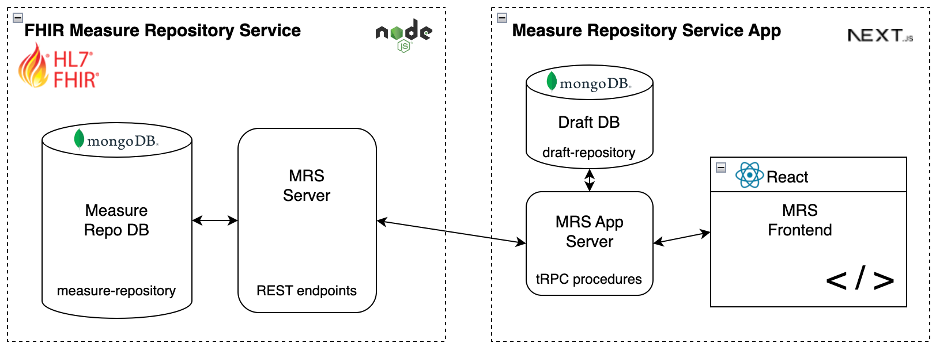

# Measure Repository

A prototype implementation of a [FHIR Measure Repository Service](http://hl7.org/fhir/us/cqfmeasures/measure-repository-service.html) and associated frontend application. This repository is a monorepo that consists of: 
- [Measure Repository Service](https://github.com/projecttacoma/measure-repository/blob/main/service/README.md)
  - Implements portions of the [FHIR Measure Repository Service](http://hl7.org/fhir/us/cqfmeasures/measure-repository-service.html) specification
  - Acts as a FHIR server and shared source of truth for measures and libraries
- [Measure Repository App](https://github.com/projecttacoma/measure-repository/blob/main/app/README.md)
  - A prototype [Next.js](https://nextjs.org/) application that demonstrates potential interactions with a FHIR Measure Repository Service
  - Includes a frontend, backend, and small database which acts as in-progress storage space for drafting measures and libraries



## Installation

### Local Installation

Clone the source code:

```bash
git clone https://github.com/projecttacoma/measure-repository-service.git
```

This repository uses [`npm workspaces`](https://docs.npmjs.com/cli/v7/using-npm/workspaces), so in order to install all dependencies, run the following:

```bash
npm install
```

If you want to install a dependency in only the `app` or the `service` directory, run the following:

```bash
npm install --workspace=<app-or-service> <package-name>
```

Copy `app/.env.example` to `app/.env.local` and `service/.env.example` to `service/.env`. Make any changes to point to the measure repository service, Mongo database, and optionally the VSAC API. `0.0.0.0` may be a more appropriate database address than `localhost` for certain environment setups.

### Mongo Replica Set Setup

Use the mongodb configuration file to configure the single node replica set. More information about the configuration file and system location, see the mongodb [configuration file documentation](https://www.mongodb.com/docs/manual/reference/configuration-options/).

1. First shutdown any currently running mongodb standalone instance: `brew services stop mongodb-community`.
2. Add this replication set configuration to the file:
```
replication:
   replSetName: rs0
```
3. Start mongodb again using homebrew: `brew services restart mongodb-community`.
4. Initialize the replica set using mongosh:
```bash
mongosh
```
```bash
rs.initiate()
```
5. From here you can continue to use the replica set, and in the future, you can do a normal start of the server using homebrew: `brew services start mongodb-community` (without need to reinitialize the replica set).

Further information on standalong to replica set conversion can be found in the mongodb [replica set conversion documentation](https://www.mongodb.com/docs/manual/tutorial/convert-standalone-to-replica-set/).

## Usage

Once you have the necessary dependencies installed, you can run the following in the root directory:

To start the app and repository service in parallel:

```bash
npm run start:all
```

This starts up the Measure Repository service at `localhost:3000` and you can open the Measure Repository Service frontend application by navigating to http://localhost:3001/mrs in your browser.

To start only the frontend:

```bash
npm run start:app
```

To start only the backend:

```bash
npm run start:service
```

To run `lint` and `prettier` in both the frontend and backend and unit tests in the backend:

```bash
npm run check:all
```
### Docker

To start the app and repository service in parallel, run 

```bash
docker compose up --build
```

#### Deploying/Running with Docker Prebuilt Images

If you wish to run pre-built images from [Docker Hub](https://hub.docker.com/u/tacoma), create a `docker-compose.yml` in your environment with the content below. This file is also found at `docker-compose.example.yml`.

```
version: '3'

services:
  measure-service:
    depends_on:
      - mongo
    image: tacoma/measure-repository-service
    environment:
      DATABASE_URL: 'mongodb://mongo:27017/measure-repository'
    ports:
      - "3000:3000"
    stdin_open: true
    tty: true

  measure-service-app:
    depends_on:
      - mongo
      - measure-service
    image: tacoma/measure-repository-app
    environment:
      # Change this for public location of measure-service this should be the FQDN and location of where the
      # measure-service container is made public to users with `4_0_1` appended. ex. https://abacus.example.com/mrs/4_0_1
      PUBLIC_MRS_SERVER: http://localhost:3000/4_0_1
      MRS_SERVER: http://measure-service:3000/4_0_1
      MONGODB_URI: mongodb://mongo:27017/draft-repository
    ports:
      - '3001:3001'
    stdin_open: true
    tty: true

  mongo:
    image: mongo:7.0
    expose:
      - "27017:27017"
    volumes:
      - mongo_data:/data/db

volumes:
  mongo_data:
```

Make sure to change the `PUBLIC_MRS_SERVER` environment variable in this file to match the location of where the FHIR server application will be accessible, this will be `http://localhost:3000/4_0_1` when connecting directly to the container running locally.

When configuring an application proxy for this, make sure the `app` is routed to `/mrs` instead of the root of the server.

#### Building new Docker Images

If you have permission to push to the tacoma organization on Docker Hub, simply run `docker-build.sh` to build a multi-platform image and push to docker hub tagged as `latest`.

## License

Copyright 2022-2024 The MITRE Corporation

Licensed under the Apache License, Version 2.0 (the "License"); you may not use this file except in compliance with the License. You may obtain a copy of the License at

```bash
http://www.apache.org/licenses/LICENSE-2.0
```

Unless required by applicable law or agreed to in writing, software distributed under the License is distributed on an "AS IS" BASIS, WITHOUT WARRANTIES OR CONDITIONS OF ANY KIND, either express or implied. See the License for the specific language governing permissions and limitations under the License.
