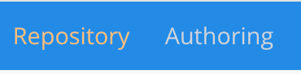
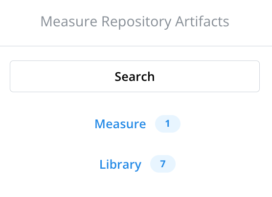
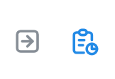
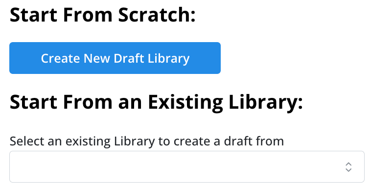

# Measure Repository Service App

A frontend application for a prototype implementation of a [FHIR Measure Repository Service](https://build.fhir.org/ig/HL7/cqf-measures/measure-repository-service.html).

- [Installation](#installation)
  - [Prerequisites](#prerequisites)
  - [Local Installation](#local-installation)
- [Usage](#usage)
- [Frontend Features](#frontend-features)
  - [Navigation](#navigation)
  - [Landing Page](#landing-page)
  - [Repository Tab](#repository-tab)
  - [Authoring Tab](#authoring-tab)

## Installation

### Prerequisites

- [Node.js >=18.0.0](https://nodejs.org/en/)
- [Git](https://git-scm.com/)

### Local Installation

At the root directory:

```bash
npm install
```

This repository uses [`npm workspaces`](https://docs.npmjs.com/cli/v7/using-npm/workspaces), so if you want to install a dependency in this directory, you have to run the following from the root directory:

```bash
npm install --workspace=app <package-name>
```

## Usage

To run just the frontend from the root directory:

```bash
npm run start:app
```

You can open the Measure Repository Service frontend application by navigating to [http://localhost:3001](http://localhost:3001) in your browser.


# Frontend Features

## Navigation

The application is divided into two main sets of functionality, _Repository_ and _Authoring_, both of which are accessible from tabs at the top of the page.



The Repository tab provides functionality for accessing and interacting with artifacts that are in the FHIR Measure Repository Service. The Authoring tab focuses on artifacts that are in the process of being drafted. Artifact content can be copied or moved between these two spaces through _draft_ and _release_ actions, described in the [Viewing](#viewing) and [Editing](#editing) sections.

Within these tabs, the left panel navigation allows for selecting artifact types or searching (Repository only) for artifacts so that they can be browsed for viewing or actions.



## Landing Page
The landing page can be accessed on first load or by clicking the Measure Repository home button in the top left corner. This page links to resources to learn more about the Measure Repository and shows existing FHIR service capabilities.

## Repository Tab
The Repository tab displays sets of artifacts from the FHIR Measure Repository Service. Options allow for viewing resource details or reviewing the resource.



### Viewing
-	Measure: Resource details show the JSON as well as options to see the Narrative, Data Requirements, and Dependencies, if they exist.          
-	Library: Resource details show the JSON as well as options to see the ELM, CQL, Narrative, Data Requirements, and Dependencies, if they exist.  
-	Drafting: Both resource views allow the user to create a draft from the artifact. This action copies the existing artifact and any children it owns to the draft Authoring space with a draft status and an incremented version to logically differentiate it from the original artifact. See the [draft operation specification](https://build.fhir.org/ig/HL7/cqf-measures/measure-repository-service.html#draft).

### Reviewing
Reviewing a resource provides options for viewing existing comments on the resource or adding a new comment. (Note: this is currently partially implemented and requires updates for viewing comments.)

## Authoring Tab
The Authoring tab gives options for creating a new draft artifact from scratch or starting from a copy of an existing artifact from the FHIR Measure Repository. 



The left navigation resource type selection displays sets of artifacts that are in progress, being drafted for potential addition to the FHIR Measure Repository. Options allow for editing, reviewing, or deleting a draft resource.


### Editing
-	Updating: A Measure or Library allows changes to basic resource fields:
    - url
    - identifier value
    - identifier system
    - name
    - title
    - description
    - library (Measure only)
- Releasing: Both resource types may be released from the editing page. This action publishes the draft artifact and any children it owns to the Repository space, adding them to the FHIR Measure Repository and giving them an active status. The draft artifact(s) will be removed from the Authoring space. See the [release operation specification](https://build.fhir.org/ig/HL7/cqf-measures/measure-repository-service.html#release).

### Reviewing
Reviewing a resource provides options for viewing existing comments on the resource or adding a new comment.

### Deleting
Deleting an artifact will permanently remove it from the draft database.
