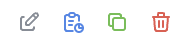

# Measure Repository Service App

A frontend application for a prototype implementation of a [FHIR Measure Repository Service](http://hl7.org/fhir/us/cqfmeasures/measure-repository-service.html).

- [Installation](#installation)
  - [Prerequisites](#prerequisites)
  - [Local Installation](#local-installation)
- [Usage](#usage)
- [Frontend Features](#frontend-features)
  - [Navigation](#navigation)
  - [Landing Page](#landing-page)
  - [Repository Tab](#repository-tab)
  - [Authoring Tab](#authoring-tab)

## Installation

### Prerequisites

- [Node.js >=18.0.0](https://nodejs.org/en/)
- [Git](https://git-scm.com/)

### Local Installation

At the root directory:

```bash
npm install
```

This repository uses [`npm workspaces`](https://docs.npmjs.com/cli/v7/using-npm/workspaces), so if you want to install a dependency in this directory, you have to run the following from the root directory:

```bash
npm install --workspace=app <package-name>
```

## Usage

To run just the frontend from the root directory:

```bash
npm run start:app
```

You can open the Measure Repository Service frontend application by navigating to [http://localhost:3001/mrs](http://localhost:3001/mrs) in your browser.

# Frontend Features

## Navigation

The application is divided into two main sets of functionality, _Repository_ and _Authoring_, both of which are accessible from tabs at the top of the page.


The Repository tab provides functionality for accessing and interacting with artifacts that are in the FHIR Measure Repository Service. The Authoring tab focuses on artifacts that are in the process of being drafted. Artifact content can be copied or moved between these two spaces through _draft_ and _release_ actions, described in the [Draft](#draft) and [Release](#release) sections.

Within these tabs, the left panel navigation allows for selecting artifact types or searching (Repository only) for artifacts so that they can be browsed for viewing or actions.


## Landing Page

The landing page can be accessed on first load or by clicking the Measure Repository home button in the top left corner. This page links to resources to learn more about the Measure Repository and shows existing FHIR service capabilities.

# Repository Tab

The Repository tab displays sets of artifacts from the FHIR Measure Repository Service. Options allow for viewing resource details or reviewing the resource.


### Viewing

- Measure: Resource details show the JSON as well as options to see the Narrative, Data Requirements, and Dependencies, if they exist.
- Library: Resource details show the JSON as well as options to see the ELM, CQL, Narrative, Data Requirements, and Dependencies, if they exist.
- Drafting: Both resource views allow the user to create a draft from the artifact. This action copies the existing artifact and any children it owns to the draft Authoring space with a draft status and an incremented version to logically differentiate it from the original artifact. See the [draft operation specification](http://hl7.org/fhir/us/cqfmeasures/measure-repository-service.html#draft).

### Review

While the Quality Measure IG is not yet entirely clear on the role of a review operation on active artifacts in a published measure repository, the frontend currently supports the temporary functionality of adding artifact comments on active artifacts due to the [review operation definition](https://build.fhir.org/ig/HL7/crmi-ig/OperationDefinition-crmi-review.html) including "regardless of status". However, this is not currently supported as an update to the artifact: artifact comments on active artifacts may be viewed in the frontend, but they may not yet be added to the artifact on the published measure repository through an update interaction.

# Authoring Tab

The Authoring tab gives options for creating a new draft artifact from scratch or starting from a copy of an existing artifact from the FHIR Measure Repository. The Authoring tab also displays options for revising, reviewing, cloning, releasing, or withdrawing a draft artifact.



## Supported Authoring Measure Repository Capabilities

The following capabilities are supported in the measure repository authoring frontend as currently defined by the [Quality Measure Implementation Guide](https://build.fhir.org/ig/HL7/cqf-measures/measure-repository-service.html#authoring-measure-repository). Note that these implementations are subject to change as the Measure Repository Service specification in the [QMIG](https://build.fhir.org/ig/HL7/cqf-measures/measure-repository-service.html#measure-repository-service) and the Artifact Repository Service in the [Canonical Resource Management Infrastructure Implementation Guide](https://hl7.org/fhir/uv/crmi/1.0.0-snapshot/CapabilityStatement-crmi-authoring-artifact-repository.html) are developed.

### Submit

The measure repository app supports the submit operation by allowing the creation of a new Measure or Library artifact in draft status. The user can achieve this action by navigating to the "Authoring" tab and clicking "Create New Draft [Measure or Library]" under "Start From Scratch":


 
### Revise

The measure repository app supports the revise operation by allowing draft artifacts to be updated through changes to the following basic resource fields:

- url
- identifier value
- identifier system
- name
- title
- description
- library (Measure only)


### Draft

The measure repository app supports the draft operation by allowing the creating a new Measure or Library artifact from an existing Measure or Library in "active" status. The user can achieve this in two ways: either the dropdown menu on the "Authoring" tab under "Start From an Existing Library" or on the "Create Draft of [Measure or Library]" button in the top right corner of an existing active Measure or Library artifact in the "Repository" tab. As more formally specified in the [CRMI Draft Operation Definition](https://build.fhir.org/ig/HL7/crmi-ig/OperationDefinition-crmi-draft.html), the draft operation is applied to the resources that an artifact is composed of, recursively. This operation is done as a batch for an artifact and any child artifacts that it is composed of.


### Release

The measure repository app supports the release operation by allowing the update of an existing draft artifact to "active" status. This involves the newly active artifact to be POSTed to the published measure repository and thus removed from the draft repository. The user can achieve this by clicking the "Release" button on a draft artifact in the "Authoring" tab. As more formally specified in the [CRMI Release Operation Definition](https://build.fhir.org/ig/HL7/crmi-ig/OperationDefinition-crmi-release.html), the release operation is applied to the resources that an artifact is composed of, recursively. This operation is done as a batch for an artifact and any child artifacts that it is composed of.


### Clone

The measure repository app supports the clone operation by allowing the ability to clone an existing draft artifact to include the contents of the existing artifact with status "draft" and a new ID. The user can achieve this with the "clone" button on the draft artifact cards in the "Authoring" tab. As more formally specified in the [CRMI Clone Operation Definition](https://build.fhir.org/ig/HL7/crmi-ig/OperationDefinition-crmi-clone.html), the clone operation is applied to the resources that an artifact is composed of, recursively. This operation is done as a batch for an artifact and any child artifacts that it is composed of.


### Withdraw

The measure repository app supports the withdraw operation by allowing the ability to delete an existing draft artifact from the draft repository. The user can achieve this with the "delete" button on the draft artifact cards in the "Authoring" tab. Although not formally specified in the QM or CRMI IGs yet, the withdraw operation is applied to the draft resources that an artifact is composed of, recursively. This operation is done as a batch for an artifact and any child artifacts that it is composed of.


### Review

The measure repository app supports the review operation by adding artifact comments to an existing draft artifact and updating the artifact's `date` and `lastReviewDate` fields. The artifact comment is currently added to a draft artifact as a [CQFM Artifact Comment Extension]("http://hl7.org/fhir/us/cqfmeasures/StructureDefinition/cqfm-artifactComment"). This extension requires a type ("Documentation", "Review", "Guidance") which can be specified in the dropdown. Optionally, the extension can include an authoredOn date and the name of the user who endorsed the comment. The review operation is more formally defined in the [CRMI Review Operation Definition](https://build.fhir.org/ig/HL7/crmi-ig/OperationDefinition-crmi-review.html). Creation of ArtifactAssessment resources in the repository is not yet available as this server supports HL7® FHIR® R4, and the ArtifactAssessment resource is only available in R5 or later versions.


